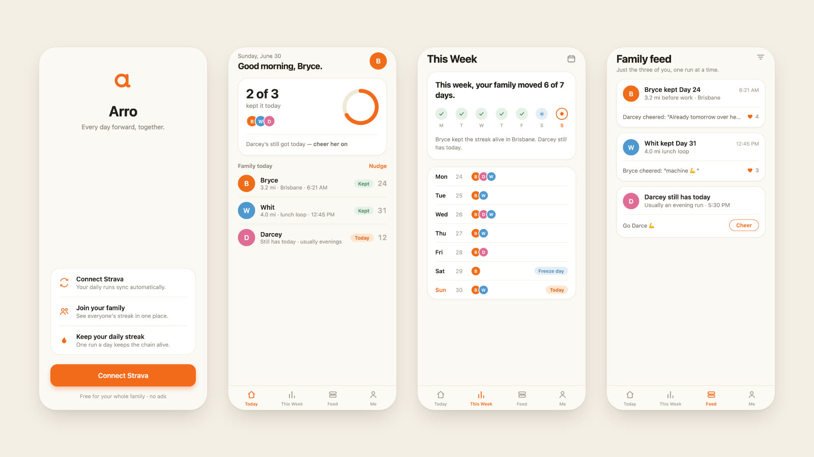

# Arro



A private running-streak app for families. Everyone runs once a day, wherever they are, and the whole family sees who's kept the streak and who still has today.

It's a high-fidelity prototype for now. Every screen is built and clickable, but it runs on fake data: there's no backend, no sign-in and no Strava connection yet.

## Run it

```bash
npm install
npx expo start --ios    # or press "i" once Expo starts
```

You'll need the iOS Simulator (or Expo Go on a phone). It also builds for the web, which is where these screenshots came from.

## What's in it

| Screen | How you get there |
| --- | --- |
| Sign-up | App launch. **Connect Strava** takes you in |
| Today | The first tab. Who's kept the streak, who still has today, and a nudge |
| This Week | The second tab. The family's week, day by day, including freeze days |
| Feed | Everyone's runs, with cheers |
| Me | Your streaks, recent runs and milestones |
| Milestone card | Tap a highlighted feed card, or a milestone badge on Me |
| Settings | The gear on Me |

## Stack

Expo SDK 57, React Native 0.86, React 19 and TypeScript. React Navigation 7 with a custom tab bar, `react-native-svg` for the logo, rings and icons, and Literata with Nunito for type. Animations use React Native's built-in `Animated`.

```
App.tsx          fonts, providers and navigation
src/theme/       colors, spacing, radii, shadows and type
src/data/        family.ts holds all the fake data
src/components/  AvatarRing, StreakRing, RunCard, CheerBar and the rest
src/screens/     one file per screen
design/          the spec and the locked design frames the app is built from
```

## What's fake for now

- Everyone's data, from members and streaks to the feed and settings, comes from `src/data/family.ts`.
- Avatars are colored initials. Each one takes an optional `photoUri`, so real photos drop in without a refactor.
- Cheers, toggles and **Connect Strava** only change local state. Share and Manage don't do anything yet.
- The launcher icon is still Expo's template. The Arro mark inside the app is the real one.

## License

MIT. See [LICENSE](LICENSE).
