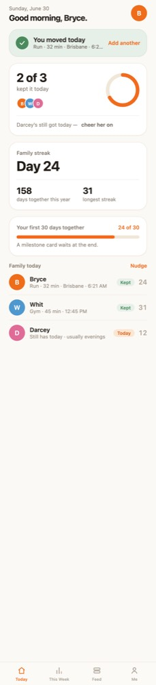
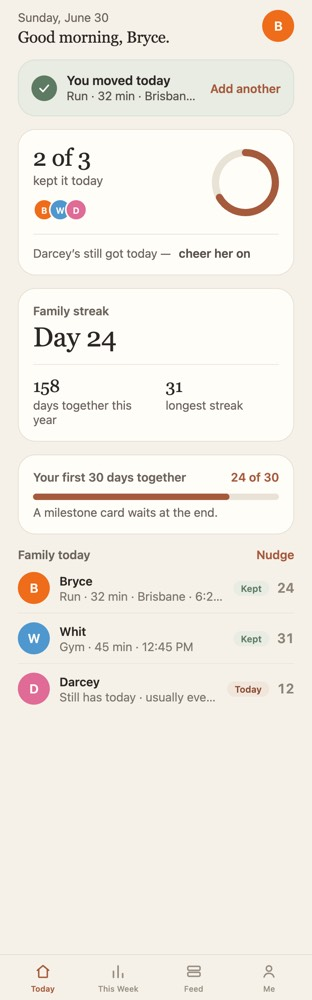
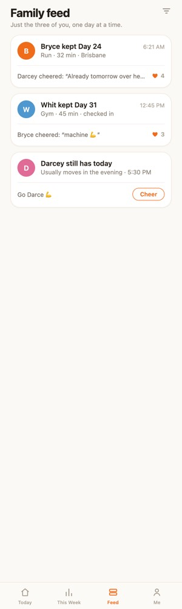
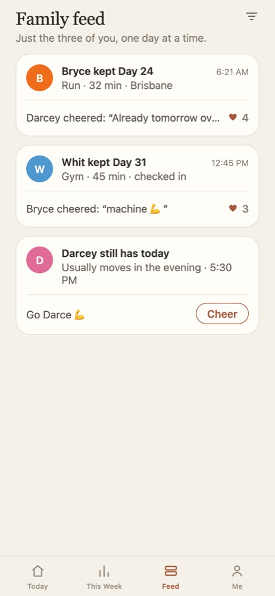
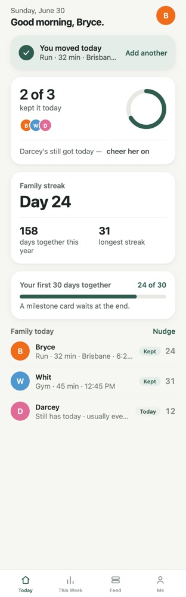
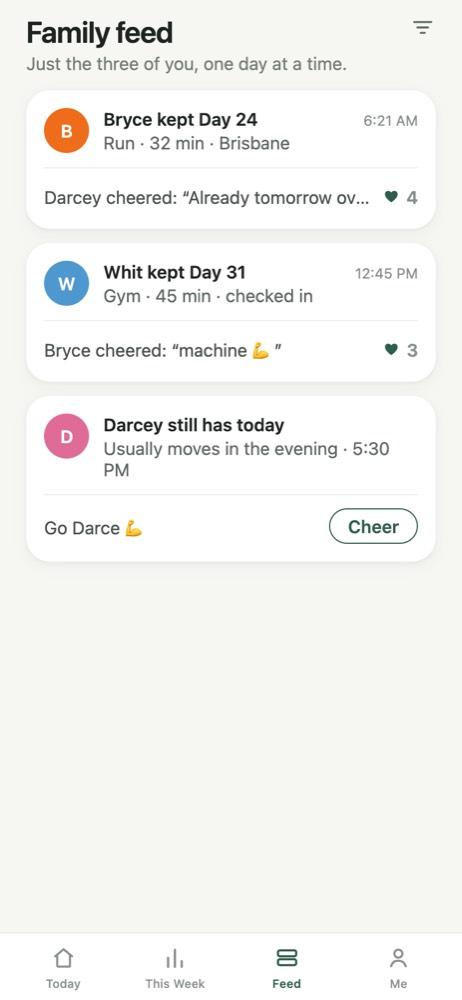

# Arro visual direction

October 2026. An audit of how Arro looks after phase 1, and two directions for
making it calm, warm and grown-up. Read with `design/market-research.md` (the
healthy-contact rules) and `design/refactor-plan.md`.

Nothing in `src/` changed for this document. The "after" screenshots are
sketches: the running web preview was recoloured in the browser, with body text
nudged up a size and (for direction A) serif headings. Shapes, spacing, borders
and shadows are only roughly right in them, and some fixed-width columns wrap
because the text got bigger. The "Today" pill in the A sketch is still tinted
clay; the table below has it neutral. They show the colour and type mood, not
finished screens.

Screens captured for the audit (web preview, 390 x 844 at 2x, not a phone):
Welcome, Sign in, Name your family, How it works, How you move, Today (waiting,
normal, day 1 after a break), Log today, Feed, This Week, Profile, Settings and
Milestone.

## What makes it feel generic

1. **One loud orange doing every job.** `primary` is `#F26A1B`, close to fully
   saturated. It's the main button, the active tab, the progress ring, the
   30-day bar, every text link ("Nudge", "Log yesterday", "Add another"),
   selected chips, the "Today" pill and the milestone pill. When the accent is
   on everything, nothing is quiet, and that hue is the house colour of
   delivery and fitness apps.
2. **The founder's avatar is the same orange.** `memberPalette[0]` is
   `#EF6C1A`, almost the brand orange, so Bryce's face reads as a button.
3. **A glowing button.** `shadows.button` is an orange shadow at 32% opacity,
   10 px blur. It's the one "app template" detail that stands out most on
   Welcome and Log today.
4. **"Today" as an orange pill.** On Today and This Week, a person who hasn't
   moved yet gets an orange pill next to the green "Kept". It's soft, but it
   reads as a status alert, which is close to the red-badge feel rule 5 rules
   out and leans against rule 2 (no public shame).
5. **Every block is the same white card.** Hairline border, near-zero shadow,
   radius 20 to 22, 16 px padding, stacked with the same gap. Today is five of
   these in a column, so nothing leads. It's the default look of a card UI kit.
6. **Small, heavy type.** Body is 13 px, meta 12.5 px, tab labels 10 px, and
   every heading is 700 weight with negative tracking. That's a startup
   dashboard. For a parent or grandparent, 13 px grey body is hard to read, and
   the greys (`muted #877E72`, `faint #948B80`) are low contrast on the
   off-white screen.
7. **Rainbow settings tiles.** Settings has five icon tiles in five hues
   (orange, blue, green, coral, violet, from `src/data/family.ts`). It copies
   iOS Settings and adds another set of bright colours.
8. **Six saturated avatar colours.** Orange, pink, blue, green, violet and
   mustard, all at similar strength. With the orange accent on top, a Today
   screen with three people shows four competing bright colours.
9. **The milestone is a stock template.** A brown photo gradient, white
   display type, an orange "Day 30" pill and an orange button. It's the
   emotional peak of the first month and it looks like a fitness-app share card.
10. **Empty space with no anchor.** Welcome has a tall blank middle under the
    logo, and Today ends in empty screen after the family list. Rule 1 (bounded,
    nothing to scroll) is right; the end of the day just doesn't look intended.

What's already good and should stay: the warm off-white background, the
bounded screens, the copy, the green "Kept" and blue freeze, plain system type,
and the restraint in shadows on cards.

## Direction A - Paper and clay

**Mood:** a letter from family. Warm paper, dark ink, one muted clay colour
used rarely. Serif headings give it a grown-up, considered feel that no fitness
app has.

- The accent becomes clay (`#A65A3C`), a brown-red with the warmth of the old
  orange and about half the saturation. It's for the one main action on a
  screen and the active tab, not for links or pills.
- Text links ("Nudge", "Log yesterday") become ink with an underline or a
  chevron, not coloured.
- Headings (titles, greeting, the streak number, milestone) use the iOS system
  serif, New York, via `fontFamily: 'ui-serif'`. React Native 0.86 maps that to
  `UIFontDescriptorSystemDesignSerif` on iOS, so no font package is needed. On
  web it falls back to Georgia.
- Cards stay flat with a hairline border, no shadow at all, a smaller radius
  (16), and more space between them, so the page reads as paper sections, not
  floating tiles.
- The "Today" pill becomes neutral (paper tone, ink text). Only "Kept" has a
  colour.
- No coloured button shadow.

| Token | Now | A |
| --- | --- | --- |
| screen | `#FBF9F5` | `#F5F1E8` |
| card | `#FFFFFF` | `#FFFDF8` |
| border | `#F0E7DA` | `#E6DFD2` |
| ink | `#221D17` | `#2B2722` |
| inkSoft | `#6F665C` | `#575049` |
| muted | `#877E72` | `#6B645B` |
| faint | `#948B80` | `#7D766C` |
| primary | `#F26A1B` | `#A65A3C` (clay) |
| primaryPress | `#D9631A` | `#8A4A31` |
| kept / keptBg | `#4A8A5D` / `#E6F0E8` | `#5D7A63` / `#E8ECE3` |
| freeze / freezeBg | `#4F8FC4` / `#E6EEF5` | `#5E7C93` / `#E6EAEE` |
| todayPillBg / text | `#FBE6D2` / `#D9631A` | `#EDE6DA` / `#575049` |
| Headings | SF, 700, tracking -0.5 | New York (`ui-serif`), 500-600, tracking 0 |
| title / greeting | 25 / 20 | 28 / 22 |
| body / meta | 13 / 12.5 | 15 / 13 |
| tab label | 10 | 11 |
| radii card / button | 22 / 16 | 16 / 14 |
| shadow card / button | faint / orange glow | none / none |
| spacing gutter / section | 22 / 18 | 20 / 28 |

Today and Feed, before and A:

 

 

## Direction B - Pine and linen

**Mood:** calm and clinical-kind, like Apple Health or a good bank app. Neutral
linen background, deep pine green for action, all system sans.

- The accent becomes pine (`#2F5D4F`). It carries "kept" too, so the app has one
  colour meaning "moved" and "do this", and the orange only survives in the
  logo if you want it.
- System sans throughout (SF Pro), headings at 600 rather than 700, bigger body.
- Cards lose the border and get a very soft neutral shadow, radius 18. White
  cards on linen, more air between them.
- The "Today" pill is neutral grey-green. Freeze stays a muted blue.

| Token | Now | B |
| --- | --- | --- |
| screen | `#FBF9F5` | `#F6F6F2` |
| card | `#FFFFFF` | `#FFFFFF` |
| border | `#F0E7DA` | `#E7E8E2` (dividers only, not card edges) |
| ink | `#221D17` | `#1E2421` |
| inkSoft | `#6F665C` | `#4A524D` |
| muted | `#877E72` | `#5F6862` |
| faint | `#948B80` | `#737C76` |
| primary | `#F26A1B` | `#2F5D4F` (pine) |
| primaryPress | `#D9631A` | `#24493E` |
| kept / keptBg | `#4A8A5D` / `#E6F0E8` | `#2F5D4F` / `#E4EDE8` |
| freeze / freezeBg | `#4F8FC4` / `#E6EEF5` | `#4F7390` / `#E6ECF1` |
| todayPillBg / text | `#FBE6D2` / `#D9631A` | `#EEF0EC` / `#4A524D` |
| Headings | SF, 700, tracking -0.5 | SF, 600, tracking -0.3 |
| title / greeting | 25 / 20 | 28 / 22 |
| body / meta | 13 / 12.5 | 15 / 13 |
| tab label | 10 | 11 |
| radii card / button | 22 / 16 | 18 / 14 |
| shadow card / button | faint / orange glow | `0 1 3 / 0 4 14` at 4-6% black / none |
| spacing gutter / section | 22 / 18 | 20 / 28 |

Today and Feed, before and B:

 

 

## Recommendation

**A, Paper and clay.** It keeps Arro's warmth, which suits a family app better
than B's health-app calm, and the serif headings are the cheapest way to look
considered rather than generated. Green is also what most health and fitness
apps already use, so B would blend in. B is the safer choice if you want it to
feel like a utility your parents already trust.

Both directions need the same follow-ups, whichever you pick:

- **Member colours.** The six avatar colours stay as they are in both sketches,
  because `memberPalette` is a copy of `private.member_palette()` in
  `supabase/migrations/20261005000001_schema.sql`. They'll be the brightest
  thing on screen after either change, and the founder's orange is the loudest.
  Softening them (same hues, less saturation) needs your go-ahead and a new
  migration, coordinated with phase 2.
- **Settings tiles** (colours in `src/data/family.ts`) and **the milestone
  screen** need screen-level work in `src/screens/` and `src/data/`, after phase
  2 is committed.
- **Fixed-width columns** (the date column on This Week, the right-hand stats on
  Today) need checking once body text is 15 px.

## What changes where

Stage 2 (once a direction is chosen): `src/theme/tokens.ts`,
`src/theme/typography.ts` and shared components in `src/components/`
(PrimaryButton, Card, Chip, TabBar, StreakRing, DayPill, Icons defaults,
PhotoSlot, ChoiceRow).

Stage 3 (after phase 2 is committed): the hard-coded colours and font sizes in
`src/screens/` (about 25 values across WorkoutDetail, Milestone, Today,
Settings, NudgeModal, ThisWeek, Profile, FamilyMembers, LogToday and Welcome),
plus the settings tile colours in `src/data/family.ts`.
